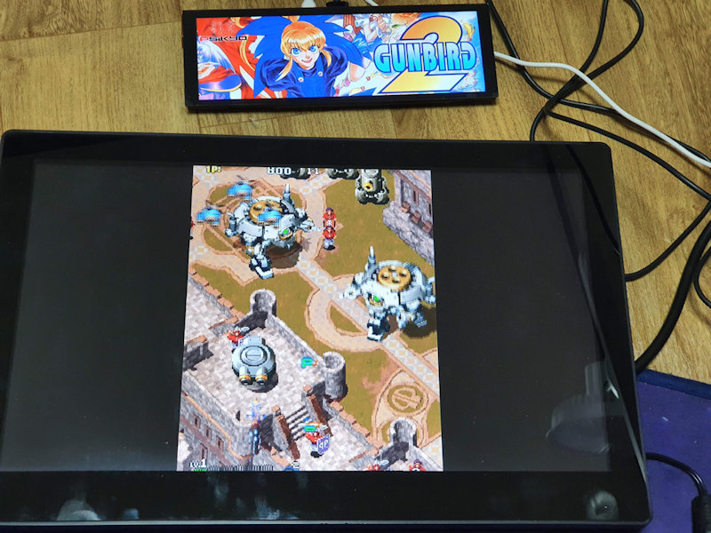

# PieMarquee2
Enhanced Marquee plugin for RetroPie, Rpi4

original code by RiNa of raspigamer forum (https://cafe.naver.com/raspigamer/)<br/>
https://github.com/rinalim/PieMarquee2

## Install
```
cd /home/pi
git clone https://github.com/losernator/PieMarquee2.git
cd PieMarquee2
chmod 755 ./install.sh
sudo ./install.sh
```
You may need to fix framebuffer resolution.<br/>
Add following line in autostart.sh file (/opt/retropie/configs/all/autostart.sh)

```fbset -fb /dev/fb0 -g 1280 720 1280 720 32```


## Files for your marquee

  * Intro Video file "intro.mp4" in "/home/pi/PieMarquee2/" folder (*optional*)
  * Maintitle video for default marquee "maintitle.mp4" in "/home/pi/PieMarquee2/marquee/" folder (*optional*)
  * Maintitle Image for default marquee "maintitle.png" in "/home/pi/PieMarquee2/marquee/" folder
  * Syetem image for each system "systemname.png" in "/home/pi/PieMarquee2/marquee/" folder (same name as rom folder eg: snes for super nintendo, fba for finalburn)
  * Marquee image for each game "gamefilename.png" in "/home/pi/PieMarquee2/marquee/" folder
  * Instruction panel image for each game "gamefilename.png" in "/home/pi/PieMarquee2/marquee/instruction" folder (*optional*)
  * publisher image for publisher "publisher.png" in "/home/pi/PieMarquee2/marquee/publisher" folder (*optional, defined in gamelist_short.xml*)
  


